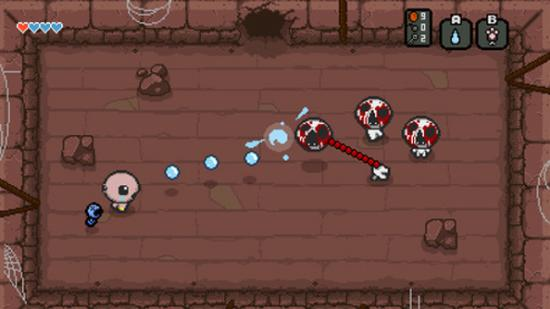

# OPINION: Emergence in games

Emergence is not needed for a good game. And we know this, because there are
plenty of successful games out there that are non-emergent. 
(Some examples being: Super Meat Boy, the whole Call of Duty franchise, Mario Kart)

But as an indie developer, we are in a field where we **NEED** to put ourselves ahead by taking risks.
If we don't, we will be outcompeted by others similar to us.

Emergence offers us a way to create way more gameplay opportunities, for very little cost.
As an indie dev, creating extra gameplay without needing to expend vast amounts of resources
is very useful.

But... what *IS* Emergence in a game context?<br/>
Emergence itself is quite hard to define! 

So in this blog post, I'll examine a few examples of good emergence from existing games,
and cherry pick what I think is the good stuff.

Keep in mind, this is all just my opinion!

Before we dive into it, though; we need to do some housekeeping.

--------------------------

## Lets discuss the golden rule:
Chess is a highly-emergent game.<br/>
Because of this, it has existed for thousands of years, and is one of the most popular
games played by people to this date.


But chess on its own is not very interesting.<br/>
Imagine if you were playing 1-player chess, where you just moved the pieces around.
Would that be very fun? (No, it's not fun. And I know it's not fun, because nobody does it.)<br/>
I'm using this example, because I want to clarify something important, which I call
"The golden rule":

- *Emergence on its own won't cut it. You need Emergence, combined with the human mind.*

Suddenly, if you have another player on the other side of the board,
plotting their moves, and attempting to discover your tactics,
you have a very interesting and complex game.

To put it elegantly, emergence in games is not about creating "cooler" or "better" rules;
rather, it's about allowing the player to create their own gameplay THROUGH the rules.[^1]

When chess was first created, I can almost guarantee that the Fried-Liver attack did not exist.
Humans created this gameplay element, *using* the emergent ruleset of chess.

--------------------------

Now, chess is a simple example that's easy to grasp, but also a very basic, and awkward example.
Since a lot of the gameplay is not actually created by the player, but rather, by the opponent.

So lets look at another game that allows its players to create gameplay value, 
without the need for an opponent:

## *Minecraft.*

Minecraft is a ground-breaking, brilliant game.
Before minecraft, there was no real sandbox game available to the casual gamer.

It was so ahead of its time, and its success kinda speaks for itself.

What I'd like to look at though, is its emergent game rules.
Now, there are 2 distinct examples that I want to pick apart here;
lets not get lost in the weeds though. The two distinct examples are:

- Emergence in building
- Emergence in engineering

## Minecraft- Emergence in building:
In minecraft, many players just want to build cool shit.
I'd argue that *most* players want to do this, actually.

- Take a look at this image:


To a minecraft player, this will look quite normal.
It's a little cottage, with a cute little wooden roof and windows. <br/>
On the right are some nice stair blocks leading to a deck.

But lets slow down a bit; take a look at the sloped roof.
On the roof of the house are ALSO stair blocks, lined up to produce a nice slope.

In Minecraft, the same blocks can be used in different ways to allow the builder 
to express their creativity to a higher degree.

Look again, at the windows, and the door. Stairs are being used AGAIN,
this time, to provide some depth to the walls, and to provide a rounded entrance.
Remember: stairs are just one block type. Players only need to remember one recipe to
create all this wonderful stuff. Isn't that brilliant? 

One block on its own does not do anything interesting, but multiple blocks
together, *combined* with the human mind, allows the player to create gameplay
opportunities for themselves.[^1]


## Minecraft- Emergence in engineering:

This is a more interesting aspect, but it also gives way to a more important concept that I
want to talk about: ***Simplicity.***

If you are a minecraft player, you have probably seen those videos of huge industrial
mob farms that automatically farm resources for you.

(If you haven't, quickly google "efficient iron farm" on youtube, you'll see a bunch of unique designs)

For a second though, lets stop to ponder. Did the developers of minecraft intend for there
to be massive, industrial item-farms?
Maybe! But whatever the case, they *definitely* did not conceive the designs.

I'll run briefly how a basic mob-farm may work, by breaking down the systems:
- Water pushes entities in its flow direction
- Mob entities spawn in the dark
- Mob entities drop item entities on death
- Entities with health take damage if they fall a big distance

With these rules, players can create a chamber that automatically spawns mobs,
pushes them to a cliff, kills the mobs, and transports the dropped items to a safe collection point.

(Also note that these rules are all independent of one another.
Any one of these rules may be used in another context independently to produce gameplay.)

These farms are not created because the minecraft devs wanted you to create them.
They are created because the players have a goal: "Get resources".
And with this goal, the players can bend the world to their will, because the rules are emergent enough
to allow it.

But, we are missing something important. The vast majority of players won't build these giant,
complex, intricately engineered item farms.

Why not?

In my opinion, it all comes down to *simplicity.*<br/>
If the rules become too difficult to apply in a creative manner, then
a bunch of players are cut off. (either because they aren't patient enough, or they aren't willing
to invest a lot of mental energy in the game.)
These massive, industrial farms are not simple to make; they require quite a deep understanding
of the game systems, and they definitely require a lot of human creativity.

Remember the golden rule: 
- *Emergence on its own won't cut it. You need Emergence, combined with the human mind.*

Players that aren't engaged enough to invest a bunch of time and energy
will fail to create these gameplay opportunities.[^1]

To sum it up, it's not about how *simple* the rules are; rather, it's about how
*simply the player can work with them.*


## Is Minecraft cheating?

Okay, we get it. Minecraft is a brilliant game.<br/> 
And its success shows it.

But doesn't it cheat? Minecraft is a sandbox game; of course its going to be highly emergent
when the player can literally alter the world.

Yes, that's true; sandbox games *are* naturally emergent.
But Minecraft still does it the best, IMO.<br/>
There are many minecraft-like games that have been no-where near as successful,
because they don't provide the player with emergent gameplay opportunities like minecraft does.

A few examples of this are:
- Eden
- Trove
- Eco

I've hardly been able to find any "automatic farm" designs for any of these games;
(Or at least, no designs that are out of scope of what the developer intended.)

Pretty much all existing designs for stuff lay within the developer's closed vision for gameplay,
which is a sign of insufficient emergence.

-------------

Okay, cool.

So what's an example of emergent gameplay that's NOT within a sandbox context?

## Emergence in the Binding of Isaac



Yup yup, it's this game.
If you play roguelikes, you probably saw this from a mile away.

The Binding of Isaac has seen years and years of praise, and is (arguably) the
most successful indie roguelike ever.

But to understand what makes Isaac fun, we need quickly understand the core game:

- Player starts a run with randomly generated levels
- Player fights her way through levels, achieving upgrades and items
- Player either dies, or beats the game in less than 40 minutes
- (Repeat, ad infinitum)

A lot of the "fun" in Isaac comes from the player's ability to obtain synergies
between items, and make an interesting/powerful combo.

But how are synergies done? There are hundreds (if not thousands) of roguelikes on the
market that have synergies between items.<br/>
What does Isaac do that's special?

-------------

Lets create two imaginary items, `Item X` and `Item Y`.

Now lets assume that items X, Y apply some effect to the player.
In this example, it doesn't matter too much what they actually do;
just know that they do *something*.

As a game designer, we might want to add a synergy between `X` and `Y`.
So, lets hardcode a little rule:
```c
Item X synergizes with Item Y, by granting 10 attack damage
```

But this is terrible.<br/>
Why? Why is this terrible?

This is terrible, because it's a very closed, non-emergent ruleset.<br/>
If another item comes along, (i.e. `Item Z`) it will never be able to mesh
creatively with the existing synergy between `X` and `Y`.

It would be much better to have a system that tags into mechanics instead.
Lets imagine we have a game mechanic "M".
Our setup could look like:
```c
Item X: provides "M"
Item Y: adds attack damage equal to "M"
```

Suddenly, we have a more interesting ruleset on our hands, that provides
the *exact same* synergy.

*Why is this better, though?*<br/>
Well, if we create another item, `Item Z`, we can mesh `Z` with the existing
mechanic `M`:
```c
Item Z: doubles "M" when the player is on low health.
```

Suddenly, we have potential for a synergy between `Item Z`, and `Item Y` for free. Isn't that brilliant?<br/>
It cost us *NOTHING* to do this, we literally gained gameplay for free.<br/>
Not only this, but any other item that meshes with the existing mechanic "M" will either be a synergy/anti-synergy to `Item Z` and `Item Y`.

The Binding of Isaac does this kind of thing really *really* well,
by having virtually all passive items tag into game mechanics and mesh with
other items by proxy.

Here are some examples.<br/>
I have listed the mechanic (`M`) that it tags into, too.

```
- Host hat: immune to explosion damage
- Kamikaze: creates a damaging explosion next to the player
- Glitter bombs: Your explosions spawn pickups
- MECHANIC: Explosions
```
This synergy gives infinite pickups, free explosions, and a tonne of damage.

```
- Brimstone:  Replaces tears with a slow, massive damaging lazer beam
- Tammys head:  releases a burst of whatever tear type is active
- MECHANIC: Fire rate / tear type
```

```
- Lump of coal:  Shots deal extra damage based on distance travelled
- Tiny planet:  Shots orbit, travelling for way longer
- MECHANIC: Shot range / shot trajectory
```

Each of these examples provides a cool synergy that is good for the player.

What's important, is that none of these items directly interact with each other.
Rather, the items mesh with *an existing mechanic*;
a mechanic that may affect (or be affected) by any other item in the game.


## Emergence as a natural phenomenon

Sometimes, instead of programming game rules directly, it might be best
to work backwards.

Take a mental note of the intended behaviour,
and develop natural rules to produce that behaviour in the game.

For example, instead of doing this:
```
when bullet entity collides ---> deal damage
```

You could do this:
```
Fast moving, sharp entities ---> Deal damage
Bullets ---> Are fast and sharp (so deal damage)
```

Note that this is also how the real world works.<br/>
The real world doesn't care if something is a "bullet", or a "train".
If you get hit by either one at great speeds, you will probably die.

So the best way to describe this kind of idea, is representing the game
in a more natural format.

This is both a bad idea, and a good idea.

-----------------

- *Why is natural emergence a good idea?*

Well, in future, players might be able to come up with creative damage devices.
Such as custom mechanical cannons, or lining up shrapnel near
explosives to kill enemies.

It opens the game rules, and allows players to think outside of the developer's
box. Remember; it's all about allowing the player to create their own gameplay.[^1]
If we provide natural, emergent rules, this is much more viable.


- *Why is natural emergence a bad idea?*
Lets talk about what I call the "Friendly-Fire dilemma".

#### The Friendly-Fire dilemma

Emergent systems are not without costs;<br/>
The biggest cost of an emergent game system is the loss of developer control.

Lets recap on our example from before.
```
Fast moving, sharp entities ---> Deal damage
Bullets ---> Are fast and sharp (so deal damage)
```

Now, lets create a quick example that could be seen in game:
```
Fast moving, sharp entities ---> Deal damage
Bullets ---> Are fast and sharp (so deal damage)

Players shoot bullet at zombie, miss and hit friend --> Player kills friend!
```

Suddenly, we have a situation where players can accidentally shoot
and kill their friends, which, (at face value,) is bad.

I call this the "Friendly Fire dilemma".

To put it frankly, this is the cost that we pay for emergent systems.
Sometimes our rules will have unintended consequences that we cannot solve without
fudging with the rules in an unnatural, non-emergent fashion.[^2]

Thankfully, these issues aren't a big deal generally; as players will actively work
*WITH* the rules to achieve their goal, not against them.<br/>
If shooting team-members hurts the chances of meeting a goal,
players probably won't do it.

Here's a little impromptu equation that describes the whole idea quite nicely:
```
Emergence * DeveloperControl  =  CONSTANT
```
With every unit of emergence we add, *by nature*, we lose control as a developer.

Similar to how John Conway couldn't control the shape of Gosper's Glider gun,
and similar to how the creators of Chess couldn't control how the Sicilian defence worked,
as a developer, you lose control of your game when you create emergent rulesets.

Note that this isn't neccessarily a "bad" thing.<br/>
With chess, the Sicilian defence does not hurt chess's integrity; it's just part of the game.

Mainly, the loss of developer control is just something to keep in mind :^)


----------------


## Emergence in Super Auto Pets

This blog post is getting quite long, but this is still a really good example that I want to cover.
Thankfully, someone else has already done a pretty good analysis on SAP's mechanics that sums up some of my thoughts.

So instead of doing my own analysis, I am instead going to link that blog post:
[Have a read if you are extra interested.](https://a327ex.com/posts/super_auto_pets_mechanics)

One significant takeaway is that unit abilities don't operate in a closed fashion.
Similar to Isaac, abilities mesh with each other in an abstract fashion, which allows players to reason about the
game creatively and come up with their own strategies.

SAP is also a pretty neat example, since it completely NAILS the simplicity aspect that was
talked about before.


# TO CONCLUDE:

It's not about creating "more interesting" gameplay, or providing
a "more in-depth" experience for the player.

Rather, it's about providing the player with sufficiently emergent rules, such that they can
create their OWN gameplay.

- *Emergence on its own won't cut it. You need Emergence, combined with the human mind.*

Thanks for reading this opinion piece!

- Oli


----------------

[^1]: When I say that a player "Creates gameplay", I mean that the player executes actions, sets goals, or interacts with the game world in a way that the developer did not directly specify. For example, a chess player executing a discovered attack with their knight. The creators of chess did not "create" this mechanic, this mechanic was instead "created" by the players.

[^2]: YES, we *could* easily hardcode it so that bullets shot by a player don't harm players. But this kinda goes against the point of emergent rulesets in the first place. The whole point of an emergent ruleset is so that the players can mesh with the rules in a creative fashion! If we put in restrictions like this, we are closing corridors of opportunity. This situation where players can harm their allies? This can also be a GOOD situation, if you look at it a bit differently. Suddenly, friendly-fire is now a mechanic of the game; a mechanic that must be taken into account when approaching levels/situations. Also, fudging with the rules in this fashion is highly unintuitive from a player PoV. Why do my bullets not deal damage to my buddies, but crashing a car into my buddies does deal damage? If we want the player to understand our rules intuitively, fudging with rules like this is a bad idea.

